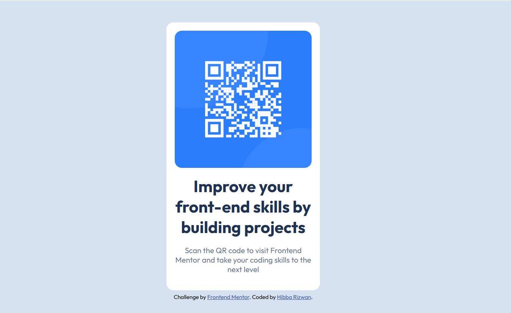

# Frontend Mentor - QR code component solution

This is a solution to the [QR code component challenge on Frontend Mentor](https://www.frontendmentor.io/challenges/qr-code-component-iux_sIO_H). Frontend Mentor challenges help you improve your coding skills by building realistic projects. 

## Table of contents

- [Overview](#overview)
  - [Screenshot](#screenshot)
  - [Links](#links)
  - [Built with](#built-with)
  - [What I learned](#what-i-learned)
  - [Author](#author)

## Overview
The challenge is to built QR code component as close as possible to the original design using semantic HTML.

### Screenshot
**Desktop View**
 

     
**Mobile View**

### Links

- Solution URL: [Solution URL](https://github.com/HibbaRizwan123/QR-code-component-solution)
- Live Site URL: [Live Site URL](https://hibbarizwan123.github.io/QR-code-component-solution/)

### Built with

- Semantic HTML5 markup
- CSS custom properties
- Flexbox

### What I learned
- I learned flexbox and its different properties.
- I learned difference between padding, margin, & gap.

## Author

- Website - [HibbaRizwan123](https://github.com/HibbaRizwan123)
- Frontend Mentor - [@HibbaRizwan123](https://www.frontendmentor.io/profile/HibbaRizwan123)

